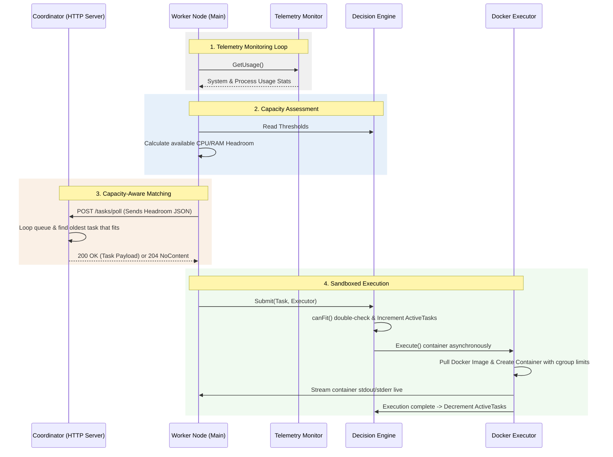

# Swarm: Resource-Aware Distributed Task Execution Engine

Swarm is a lightweight, distributed task execution framework designed for orchestrating diverse containerized workloads across transient compute environments. 

Unlike traditional distributed queues that rely on static concurrency limits, Swarm agents utilize real-time local telemetry to dynamically throttle or scale execution capacity. It implements **Capacity-Aware Matchmaking** where workers report their current resource headroom (CPU and Memory) to the Coordinator, which automatically dispatches the best-fitting task in FIFO order, preventing resource thrashing and eliminating Out-of-Memory (OOM) crashes in high-density multi-tenant environments.

---

## Architectural Flow Diagram



---

## Key Features

* **Multi-Dimensional Matchmaking**: Workers evaluate and report available capacity at both the **System** (host) level and **Process** (worker container) level, protecting cgroup boundaries.
* **cgroup Resource Sandboxing**: Uses the Docker API to enforce strict CPU cores (NanoCPUs) and Memory byte allocations for each container on spin-up.
* **Log Multiplexing**: Captures container stdout and stderr streams and redirects them to the worker's stdout/stderr console in real-time.
* **Pull-Based Topology**: Employs an outbound-only polling pattern from workers to the coordinator, simplifying firewall traversal and network security policies.
* **Zero Dependency Binaries**: Compiles into single self-contained executable binaries for both worker and coordinator.

---

## Directory Structure

```text
├── cmd
│   ├── coordinator             # Coordinator entrypoint executable binary (main)
│   │   └── main.go
│   ├── worker                  # Worker entrypoint executable binary (main)
│   │   └── main.go
│   └── internal                # Internal private core modules
│       ├── coordinator         # Coordinator HTTP controller and matchmaking queue
│       │   ├── controller.go
│       │   └── coordinator.go
│       └── worker              # Worker core packages
│           ├── connection      # Polling driver and headroom calculations
│           │   ├── connection.go
│           │   └── connection_test.go
│           ├── decision_engine # Capacity limits double-check and concurrency guard
│           │   └── decisionengine.go
│           ├── executor        # Task models and Docker SDK executor implementation
│           │   ├── dockerexecutor.go
│           │   ├── executor.go
│           │   ├── resourcerequirement.go
│           │   └── task.go
│           ├── telemetry       # Real-time resource metrics scraper (gopsutil)
│           │   ├── monitor.go
│           │   └── telemetry.go
│           └── test            # Integration and throttling test suites
│               └── worker_test.go
├── docs
│   ├── progress.md             # Development milestone tracker
│   └── problem_statement.md    # Formal engine requirements specification
└── go.mod
```

---

## Getting Started

### 1. Start the Coordinator
The Coordinator maintains the task queue. Start the server on port `8081`:
```bash
PORT=8081 go run cmd/coordinator/main.go
```

### 2. Start one or more Workers
Start the worker node(s) in a separate terminal. The worker will connect, poll, and run Docker containers locally:
```bash
COORDINATOR_URL=http://localhost:8081 go run cmd/worker/main.go
```

### 3. Ingest a Task
Submit a task via HTTP. This task runs a python container that calculates Pi using the Basel Series, capped at $0.5$ CPU cores and $50\text{MB}$ of RAM:
```bash
curl -X POST http://localhost:8081/tasks \
  -H "Content-Type: application/json" \
  -d '{
    "id": "python-math-pi",
    "image": "python:3.9-alpine",
    "cmd": ["python", "-c", "import math; print(f\"Real Pi value: {math.sqrt(6 * sum(1/n**2 for n in range(1, 1000000)))}\")"],
    "resource_requirement": {
      "required_system_cpu": 0.5,
      "required_system_memory": 52428800
    }
  }'
```

You will see the worker pull the image, execute it, print the logs (`Real Pi value: 3.141591...`), and clean up the container resources!

### 4. Running the Tests
To run the full unit and integration test suite:
```bash
go test -v ./...
```
