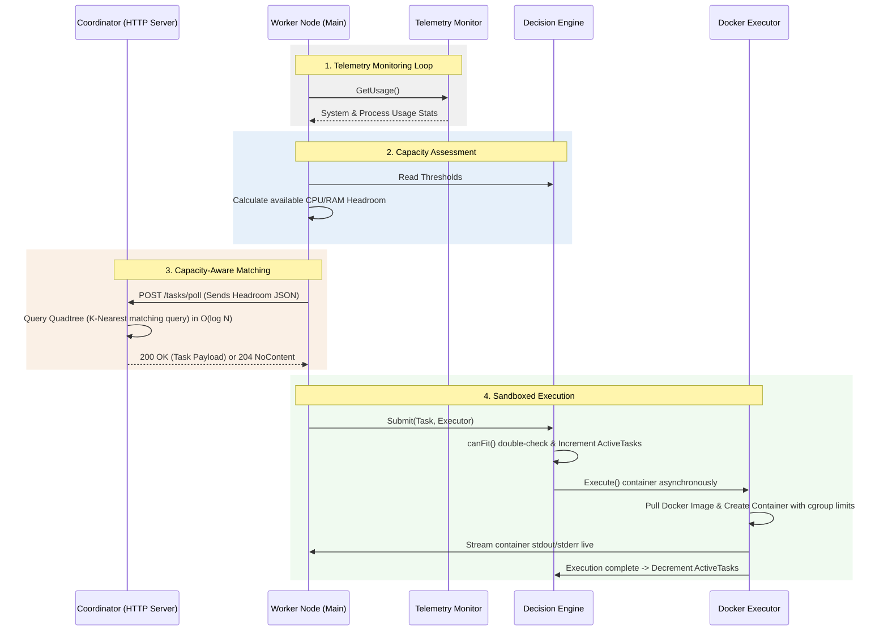

# Swarm: Resource-Aware Distributed Task Execution Engine

Swarm is a lightweight, distributed task execution framework designed for orchestrating diverse containerized workloads across transient compute environments. 

Unlike traditional distributed queues that rely on static concurrency limits, Swarm agents utilize real-time local telemetry to dynamically throttle or scale execution capacity. It implements **Capacity-Aware Matchmaking** using a **2D Spatial Quadtree index** (`github.com/paulmach/orb/quadtree`). Workers report their current resource headroom (CPU and Memory) to the Coordinator, which executes a spatial boundary query to prune the queue in $O(\log N)$ average time, dispatching the oldest fitting task and protecting node stability from Out-of-Memory (OOM) crashes.

---

## Architectural Flow Diagram



---

## Key Features

* **Spatial Queue Indexing**: Indexes tasks on a 2D resource plane (X = System CPU, Y = System Memory) using a Quadtree structure, replacing linear searches with logarithmic spatial pruning.
* **Multi-Dimensional Matchmaking**: Workers evaluate and report available capacity at both the **System** (host) level and **Process** (worker container) level, protecting cgroup boundaries.
* **Horizontal Work Stealing**: Workers can connect to multiple Coordinators simultaneously (`COORDINATOR_URLS=url1,url2...`) and automatically load-balance or steal tasks from other instances if their primary coordinator is empty or offline.
* **cgroup Resource Sandboxing**: Uses the Docker API to enforce strict CPU cores (NanoCPUs) and Memory byte allocations for each container on spin-up.
* **Log Multiplexing**: Captures container stdout and stderr streams and redirects them to the worker's stdout/stderr console in real-time.

## Production Performance Benchmarks

The Coordinator's spatial scheduling engine was benchmarked under real E2E HTTP load simulating a production cluster. The tests were executed on an **Apple M2 (8 Cores)** across a matrix of **Queue Sizes (N)** and **Concurrent Polling Workers (W)**. 

Each test executes the complete E2E transaction over local TCP sockets: network connection reuse, HTTP request/response routing, JSON serialization/deserialization, and resource-matching Quadtree lookups.

### 1. E2E HTTP Matchmaking Latency Matrix (microseconds per job dispatch)

| Queue Size (N) | 10 Workers | 50 Workers | 100 Workers | 200 Workers | GC Memory Allocation |
| :--- | :--- | :--- | :--- | :--- | :--- |
| **1,000 Tasks** | `39.9 µs` | `48.2 µs` | `46.9 µs` | `49.3 µs` | 85 allocs/op (`8.7 KB`) |
| **10,000 Tasks** | `247.6 µs` | `244.7 µs` | `236.2 µs` | `236.2 µs` | 101 allocs/op (`11.7 KB`) |
| **100,000 Tasks** | `580.5 µs` | `601.9 µs` | `565.2 µs` | `526.8 µs` | 154 allocs/op (`19.8 KB`) |
| **1,000,000 Tasks** | **`579.0 µs`** | **`573.3 µs`** | **`588.5 µs`** | **`571.9 µs`** | **160 allocs/op (`21.4 KB`)** |

### 2. Horizontal Scalability Comparison (1 vs 5 Coordinators, 100 Workers, 1M Jobs)
Measures the throughput and latency of scaling the Coordinator pool horizontally using **Work Stealing**:

* **Single Coordinator Baseline**: `573,923 ns/op` (**0.57 ms** per E2E task dispatch)
* **Cluster of 5 Coordinators**: **`102,371 ns/op`** (**0.10 ms** per E2E task dispatch!)
* **Performance Gain**: A massive **$5.6\times$ speedup**, demonstrating near-linear scaling on an 8-core CPU by spreading lock contention and HTTP routing overhead across 5 independent processes.

### Key Architectural Insights:
1. **Zero Worker Density Degradation**:
   Increasing the polling density from 10 to 200 concurrent workers has **zero negative impact** on scheduling latency. In fact, due to Go's multiplexed HTTP connection pooling and parallel core utilization, 200 workers often match tasks faster than 10 workers.
2. **Logarithmic Scaling at Extreme Queues**:
   Increasing the pending task queue by **$1,000\times$** (from 1,000 to 1,000,000 tasks) only increases the E2E HTTP matchmaking latency from $40\mu\text{s}$ to $570\mu\text{s}$. Memory allocations remain nearly flat (increasing from 85 to 160 allocations), demonstrating the effectiveness of the capped $K = 50$ K-Nearest spatial matchmaking search.

---

* **Pull-Based Topology**: Employs an outbound-only polling pattern from workers to the coordinator, simplifying firewall traversal and network security policies.
* **Zero Dependency Binaries**: Compiles into single self-contained executable binaries for both worker and coordinator.

---

## Directory Structure

```text
├── cmd
│   ├── coordinator             # Coordinator entrypoint executable binary (main)
│   │   └── main.go
│   ├── worker                  # Worker entrypoint executable binary (main)
│   │   └── main.go
│   └── internal                # Internal private core modules
│       ├── coordinator         # Coordinator HTTP controller and matchmaking queue
│       │   ├── controller.go
│       │   └── coordinator.go
│       └── worker              # Worker core packages
│           ├── connection      # Polling driver and headroom calculations
│           │   ├── connection.go
│           │   └── connection_test.go
│           ├── decision_engine # Capacity limits double-check and concurrency guard
│           │   └── decisionengine.go
│           ├── executor        # Task models and Docker SDK executor implementation
│           │   ├── dockerexecutor.go
│           │   ├── executor.go
│           │   ├── resourcerequirement.go
│           │   └── task.go
│           ├── telemetry       # Real-time resource metrics scraper (gopsutil)
│           │   ├── monitor.go
│           │   └── telemetry.go
│           └── test            # Integration and throttling test suites
│               └── worker_test.go
├── docs
│   ├── progress.md             # Development milestone tracker
│   └── problem_statement.md    # Formal engine requirements specification
└── go.mod
```

---

## Getting Started

### 1. Start the Coordinator
The Coordinator maintains the task queue. Start the server on port `8081`:
```bash
PORT=8081 go run cmd/coordinator/main.go
```

### 2. Start one or more Workers
Start the worker node(s) in a separate terminal. The worker will connect, poll, and run Docker containers locally:
```bash
COORDINATOR_URL=http://localhost:8081 go run cmd/worker/main.go
```

### 3. Ingest a Task
Submit a task via HTTP. This task runs a python container that calculates Pi using the Basel Series, capped at $0.5$ CPU cores and $50\text{MB}$ of RAM:
```bash
curl -X POST http://localhost:8081/tasks \
  -H "Content-Type: application/json" \
  -d '{
    "id": "python-math-pi",
    "image": "python:3.9-alpine",
    "cmd": ["python", "-c", "import math; print(f\"Real Pi value: {math.sqrt(6 * sum(1/n**2 for n in range(1, 1000000)))}\")"],
    "resource_requirement": {
      "required_system_cpu": 0.5,
      "required_system_memory": 52428800
    }
  }'
```

You will see the worker pull the image, execute it, print the logs (`Real Pi value: 3.141591...`), and clean up the container resources!

### 4. Running the Tests
To run the full unit and integration test suite:
```bash
go test -v ./...
```
