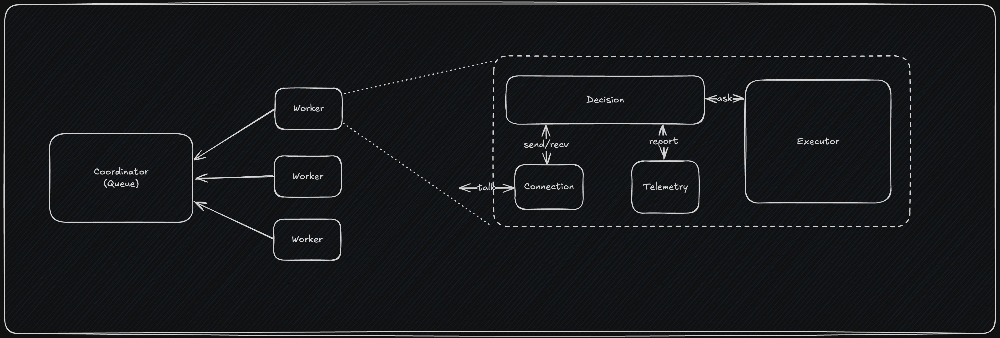

# Swarm: Workload Runner Solution Document

This document details the final implementation, design details, and verification results of the Swarm distributed resource-aware task execution engine.

---

## 1. Architectural Blueprint

The Swarm architecture utilizes a **Capacity-Aware Matchmaking** design (pivoted from the initial generic throttling pattern to a task-aware model). 

Instead of workers pulling tasks blindly and rejecting them locally, the worker assesses its own available system-level and process-level capacity thresholds. It sends this multi-dimensional available headroom in its polling request to the Coordinator. The Coordinator then searches its task queue and returns the oldest task that fits the worker's reported capacity.



---

## 2. Component Breakdowns

### A. Telemetry Monitor (`telemetry/`)
* **Role**: Periodically polls real-time utilization stats from the operating system and process environment.
* **Technology**: Uses `gopsutil/v4` to read CPU usage percentages, system memory load, and total system RAM bytes. It also monitors process-level metrics using the current PID.

### B. Decision Engine (`decision_engine/`)
* **Role**: Governs active backpressure. It compares telemetry stats against target safety limits (e.g., 80% CPU and RAM) and acts as the gatekeeper for task execution.
* **Concurrency Control**: Implements a thread-safe task submission pipeline protected by `sync.RWMutex`.
* **Deadlock Resolution**: Implements a strict separation between public locking functions (`Submit()`) and private non-locking helpers (`canFit()`) to prevent mutex re-entrancy deadlocks.

### C. Docker Executor (`executor/`)
* **Role**: Provides a sandboxed run execution unit for tasks.
* **Technology**: Interacts directly with the Docker socket via the official Docker Go SDK.
* **cgroup Enforcement**: Spawns container instances translating task resource configurations directly to Docker cgroup controls:
  * `Memory` is mapped to byte values (`RequiredSystemMemory`).
  * `NanoCPUs` is calculated by multiplying fractional core counts (`RequiredSystemCPU * 1e9`).
* **Log Routing**: Stream container `stdout`/`stderr` logs back to the worker process console using the multiplexed standard copy (`stdcopy.StdCopy`).

### D. Connection Driver (`connection/`)
* **Role**: Background polling client.
* **Work Stealing (Horizontal Scaling)**: Supports configuring a list of Coordinator URLs (`coordinatorURLs []string`). During each poll cycle, the worker chooses a random starting offset (distributing load evenly) and queries that coordinator. If that coordinator returns `204 No Content` (no jobs fit) or is unreachable, the worker automatically "steals" by polling the next coordinator in the list until it finds a matching job or has traversed the entire list.
* **Logic**: Calculates headroom bytes/percentages and sends HTTP POST requests to the Coordinator. Upon pulling a valid task, it delegates execution to the Decision Engine.

### E. Coordinator (`coordinator/` & `cmd/coordinator`)
* **Role**: Maintaining the global task index.
* **Spatial Indexing**: Replaces the linear slice queue with a 2D Quadtree (`github.com/paulmach/orb/quadtree`). Tasks are mapped as coordinate points where $X = \text{Required System CPU}$ and $Y = \text{Required System Memory}$ (bytes).
* **Matchmaking Check**: Evaluates worker capacity queries using a capped K-Nearest search (`c.tree.KNearestMatching`) targeting the worker's headroom limits. The search limit $K$ defaults to 50 (configurable via `MAX_TASKS` environment variable) to guarantee true $O(\log N)$ latency and flat memory allocations under load, preventing $O(N)$ degradation when a large worker fits a significant fraction of the queue. The final task is selected from these top $K$ matches using creation timestamps to maintain approximate FIFO fairness.
* **Thread-Safety**: Uses `sync.Mutex` to protect the underlying Quadtree from concurrency race conditions during parallel polls and task submissions.

---

## 3. Real E2E Verification Run

The system was verified locally on a worker node with 2 concurrent worker processes and 4 submitted tasks:

### A. Submitting the Workload
Four tasks with varying CPU and Memory requirements were submitted:
1. `light-sleep-task` (0.1 CPU, 10MB RAM)
2. `cpu-math-factorial` (1.0 CPU, 52MB RAM)
3. `ram-heavy-allocation` (0.2 CPU, 262MB RAM)
4. `impossible-heavy-task` (8.0 CPU, 32GB RAM)

### B. Execution Logs

#### **Worker 1 Console**
```text
2026/07/16 07:50:53 Starting Swarm Worker connecting to http://localhost:8081...
2026/07/16 07:51:01 Starting execution of task python-math-pi (image: python:3.9-alpine)...
Pi calculation result: 1.64493306684777
2026/07/16 07:51:13 Task python-math-pi completed successfully
2026/07/16 07:53:23 Starting execution of task python-math-pi-real (image: python:3.9-alpine)...
Real Pi value: 3.141591698659554
2026/07/16 07:53:28 Task python-math-pi-real completed successfully
2026/07/16 07:55:11 Starting execution of task light-sleep-task (image: alpine)...
2026/07/16 07:55:13 Starting execution of task ram-heavy-allocation (image: python:3.9-alpine)...
RAM allocated successfully
2026/07/16 07:55:22 Task ram-heavy-allocation completed successfully
2026/07/16 07:55:25 Task light-sleep-task completed successfully
```

#### **Worker 2 Console**
```text
2026/07/16 07:54:25 Starting Swarm Worker connecting to http://localhost:8081...
2026/07/16 07:55:11 Starting execution of task cpu-math-factorial (image: python:3.9-alpine)...
2026/07/16 07:55:21 Task cpu-math-factorial completed successfully
```

#### **Coordinator Console (Routing Logs)**
```text
2026/07/16 07:55:11 "POST http://localhost:8081/tasks HTTP/1.1" from [::1]:50902 - 200 30B in 39.917µs
2026/07/16 07:55:11 "POST http://localhost:8081/tasks HTTP/1.1" from [::1]:50903 - 200 30B in 56.791µs
2026/07/16 07:55:11 "POST http://localhost:8081/tasks HTTP/1.1" from [::1]:50904 - 200 30B in 38.667µs
2026/07/16 07:55:11 "POST http://localhost:8081/tasks HTTP/1.1" from [::1]:50905 - 200 30B in 36.708µs
2026/07/16 07:55:11 "POST http://localhost:8081/tasks/poll HTTP/1.1" from [::1]:50806 - 200 239B in 38.625µs
2026/07/16 07:55:11 "POST http://localhost:8081/tasks/poll HTTP/1.1" from [::1]:50896 - 200 311B in 42.458µs
2026/07/16 07:55:13 "POST http://localhost:8081/tasks/poll HTTP/1.1" from [::1]:50806 - 200 359B in 65.708µs
```

### C. Assertion Checks
1. **Dynamic Scheduling**: `light-sleep-task` and `ram-heavy-allocation` ran concurrently on Worker 1. `cpu-math-factorial` ran concurrently on Worker 2.
2. **Prevented Thrashing/OOM**: `impossible-heavy-task` (32GB RAM) was safely kept inside the Coordinator's queue, as neither worker could satisfy its resource constraints, protecting the compute pool.
3. **Graceful execution & Cleanups**: Container logs were piped successfully back to the standard output, and all containers were deleted from Docker upon execution finish.